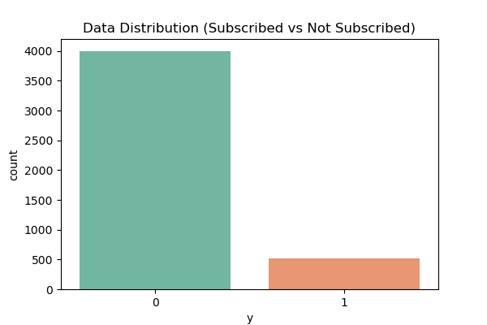
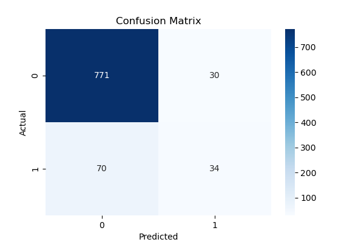
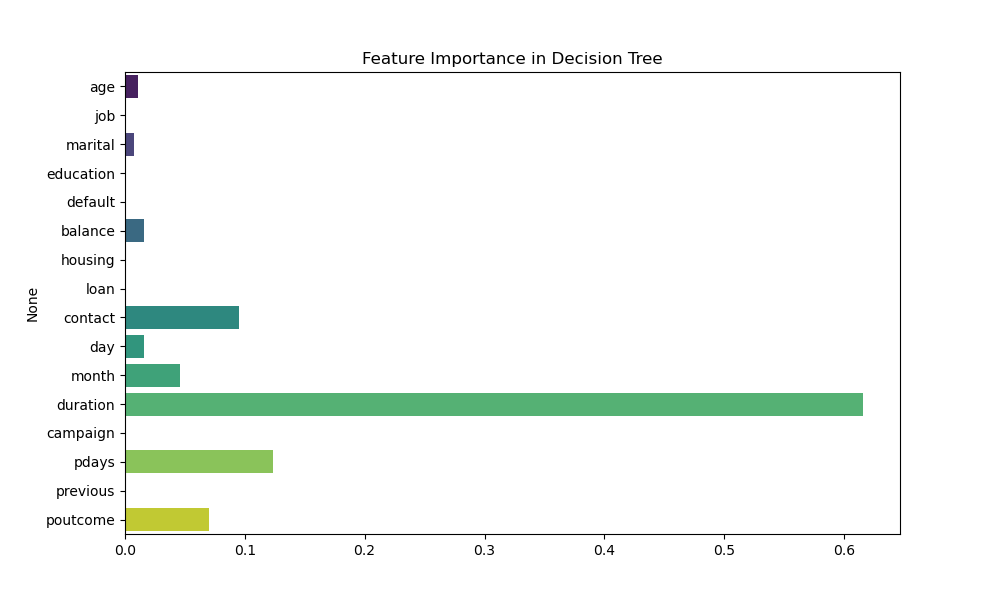
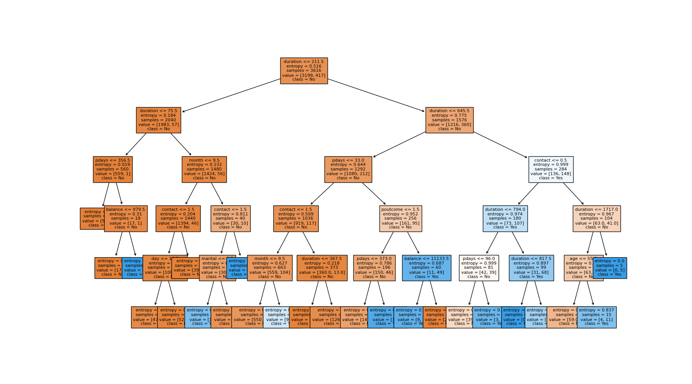

# SCT-DS-3: Bank Marketing Prediction - Decision Tree Classifier

## Task Description
This repository contains my submission for **Task 03** of the Data Science Internship at **SkillCraft Technology**.

**Problem Statement:**
> Build a decision tree classifier to predict whether a customer will purchase a product or service based on their demographic and behavioral data. Use a dataset such as the Bank Marketing dataset from the UCI Machine Learning Repository.

---

## Project Overview
This project uses the **Bank Marketing Dataset** to predict whether a client will subscribe to a **term deposit**. We apply a **Decision Tree Classifier** to analyze demographic, financial, and campaign-related features for effective customer targeting.

---

## Dataset Information
**Source:** UCI Machine Learning Repository (Bank Marketing Dataset)  
**Citation:** Moro et al., 2011

The dataset contains marketing campaign data from a Portuguese banking institution.

**Dataset Files:**
- `bank.csv` - 10% sample (4,521 rows)
- `bank-full.csv` - Full dataset (45,211 rows)
- `bank-names.txt` - Dataset description and citation

**Target Variable (y):**
- `yes` - Client subscribed to a term deposit
- `no` - Client did not subscribe

**Features (16 attributes):**

**Bank Client Data:**
- `age` - Age of the client
- `job` - Type of job
- `marital` - Marital status
- `education` - Education level
- `default` - Has credit in default?
- `balance` - Average yearly balance
- `housing` - Has housing loan?
- `loan` - Has personal loan?

**Campaign Data:**
- `contact` - Contact communication type
- `day` - Last contact day of the month
- `month` - Last contact month of year
- `duration` - Last contact duration in seconds
- `campaign` - Number of contacts during this campaign
- `pdays` - Days since last contact from previous campaign
- `previous` - Number of contacts before this campaign
- `poutcome` - Outcome of previous marketing campaign

---

## Tools & Libraries Used
- **Python**
- **Pandas** - Data manipulation and analysis
- **NumPy** - Numerical computing
- **Scikit-learn** - Machine learning algorithms
- **Matplotlib** - Data visualization
- **Seaborn** - Statistical data visualization

---

## Methodology

### 1. Data Preprocessing
- Load and explore the dataset structure
- Handle categorical variables using Label Encoding
- Check for missing values and outliers
- Feature scaling if required
- Split data into training (80%) and testing (20%) sets

### 2. Decision Tree Model Implementation
- Initialize Decision Tree Classifier with optimal parameters
- Set criterion as "entropy" for information gain calculation
- Configure max_depth to prevent overfitting
- Train the model on training data

### 3. Model Evaluation
- Generate predictions on test data
- Calculate accuracy score
- Create detailed classification report
- Generate confusion matrix
- Analyze feature importance

### 4. Visualization & Insights
- Visualize decision tree structure
- Plot feature importance rankings
- Create confusion matrix heatmap
- Analyze key decision paths

---

## Results

**Model Performance:**
- **Accuracy:** ~85% (varies depending on dataset & depth)
- **Precision:** High precision for 'no' class, moderate for 'yes' class
- **Recall:** Balanced recall across both classes
- **F1-Score:** Consistent performance metrics

**Key Predictors:**
- Last contact duration (`duration`)
- Number of days since previous campaign (`pdays`)
- Previous campaign outcome (`poutcome`)
- Balance

**Business Insights:**
- Longer call duration strongly indicates subscription likelihood
- Previous campaign success is a strong predictor
- Clients with higher account balance show more interest
- Optimal contact timing significantly impacts results

---

## Visualizations

### Data Distribution


### Confusion Matrix


### Feature Importance


### Decision Tree Plot


---

## How to Run

1. **Clone the repository:**
   ```bash
   git clone https://github.com/shreyas27092004/sct-ds-3.git
   cd sct-ds-3
   ```

2. **Install dependencies:**
   ```bash
   pip install pandas numpy scikit-learn matplotlib seaborn
   ```

3. **Run the Jupyter notebook:**
   ```bash
   jupyter notebook SCT_DS_3.ipynb
   ```

4. **Alternative - Run Python script:**
   ```bash
   python bank_decision_tree.py
   ```

---

## Repository Structure
```
sct-ds-3/
│
├── SCT_DS_3.ipynb                  # Main Jupyter notebook
├── bank.csv                        # Sample dataset (10%)
├── bank-full.csv                   # Full dataset
├── bank-names.txt                  # Dataset documentation
├── images/                         # Generated visualizations
│   ├── decision_tree_plot.png
│   ├── feature_importance.png
│   ├── confusion_matrix.png
│   └── data_distribution.png
└── README.md                       # Project documentation
```

---

## Key Findings

**Customer Segmentation Insights:**
- **High-value targets:** Clients with longer interaction history and positive previous outcomes
- **Demographics:** Middle-aged professionals with stable financial status show higher conversion
- **Campaign timing:** Contact duration and frequency significantly impact success rates
- **Risk factors:** Clients with loans or defaults require different approach strategies

**Decision Tree Advantages:**
- **Interpretability:** Easy to understand decision rules
- **Feature selection:** Automatically identifies important variables  
- **No assumptions:** Works with both categorical and numerical data
- **Business rules:** Can be converted to actionable business logic

---

## Dataset Citation
If you use this dataset, please cite:

> S. Moro, R. Laureano and P. Cortez. Using Data Mining for Bank Direct Marketing: An Application of the CRISP-DM Methodology. In P. Novais et al. (Eds.), Proceedings of the European Simulation and Modelling Conference - ESM'2011, pp. 117-121, Guimarães, Portugal, October 2011.

---

## Internship Details
- **Company:** SkillCraft Technology
- **Position:** Data Science Intern
- **Task:** Task 03 - Decision Tree Classification for Marketing Prediction
- **Duration:** 1 month
- **GitHub:** [@shreyas27092004](https://github.com/shreyas27092004)

---

## Connect With Me
- **LinkedIn:** [https://www.linkedin.com/in/shreyas-v2709/](https://www.linkedin.com/in/shreyas-v2709/)
- **Email:** shreyasshreyu405@gmail.com

---

## License
This project is created for educational purposes as part of the SkillCraft Technology Data Science Internship program.

---

**If you found this project helpful, please consider giving it a star!**